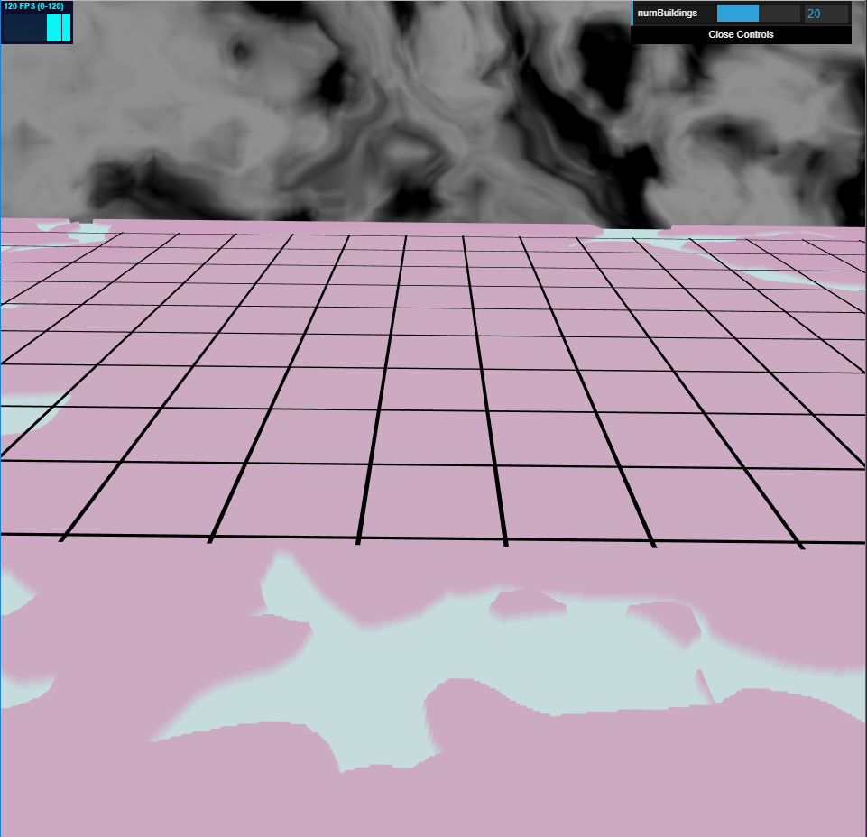

# Homework 6: Calm
Jake Snipes

PennKey: jsnipes

## Images

A dreamy, pastel land is at rest as a storm brews in the background. Unfortunately, no buildings show up; I had trouble getting them to draw, but I think my logic and setup is correct.

## Techniques
### Terrain
The terrain was generated using 2D FBM. Land and water were differentiated by setting a noise value threshold and altering the height (y position) accordingly. 

### Sky
The sky background uses recursive 3D multi-octave FBM to create a stormy effect and is colored using the luminance value of a custom cosine color palette. The flashing lightning effect is achieved with time-based pattern generation and time-based noise value adjustment.

### Roads
The roads are all generated from a single square mesh that is read in from an OBJ file. Each road instance has a different transformation applied and is rendered using instanced rendering.

### Buildings
Before generating the buildings, a high-resolution grid is overlaid on the terrain; this grid checks for roads and water to determine if a given cell is valid for building placement. Once all cells have been marked as valid or invalid, a certain number of valid cells are randomly selected for building placement based on the numBuildings GUI input. 

The buildings themselves are created following the algorithm described in Section 3 of "Real-time Procedural Generation of 'Pseudo Infinite' Cities" (2003). A random regular polygon is generated at a randomly selected height above the terrain; this represents the building's top floor. Lower floors are generated by moving vertically down by a random height, generating a new random polygon centered at one of the existing vertices, and computing the union of all the polygons to represent the building's overall floor plan.

Though they cannot be seen, the buildings are meant to get smaller as the distance from the terrain's origin (i.e. - the intended city center) increases to represent a city that grew radially outward. I believe something is wrong with my VBO setup after creation, as I found that my indices, positions, and normals line up as desired.

Since I was unable to draw them, I was unable to apply artistic lighting but planned on using time-based three-point lighting and Lambertian shading to extend the sky background's lightning effect.

### GUI Inputs
numBuildings: Controls how many buildings would be spawned in the city

## Live Demo
https://jacobsnipes.com/hw06-city-generation

## Resources Used
All resources are cited as comments in the code where they are used, except for instances wherein I reused code from previous homework assignments.